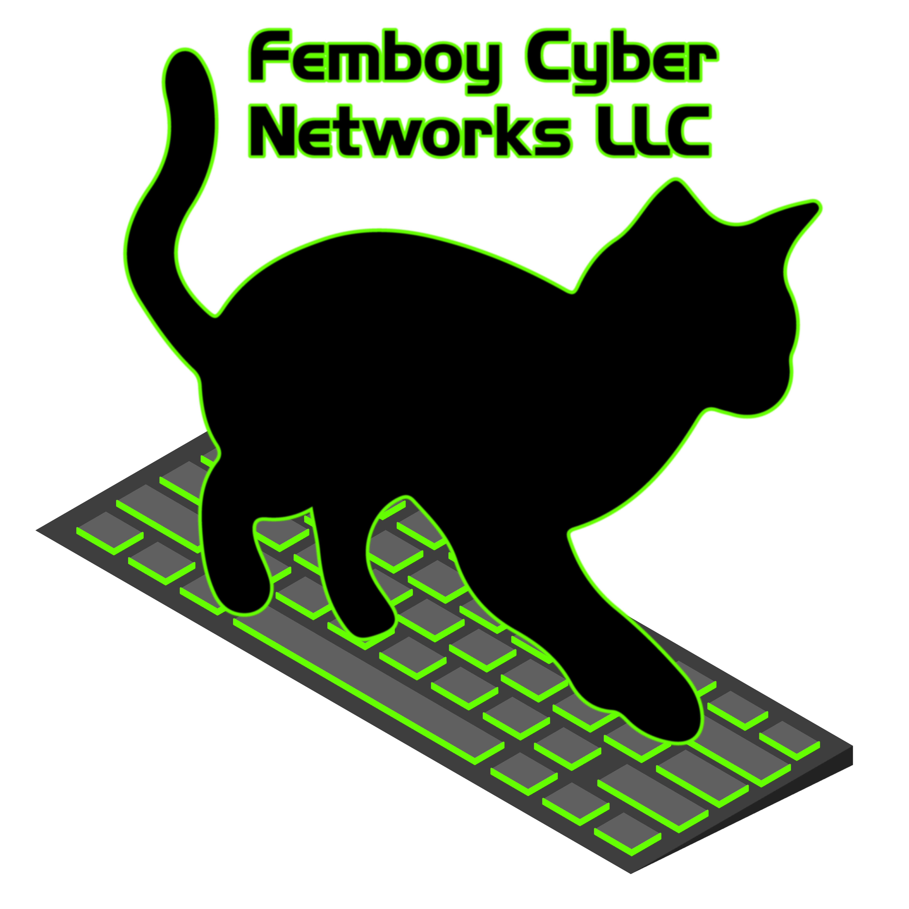

> [!IMPORTANT]
> 
>
> **Network:** [FEMBOY][1]
>
> **RIR:** [RIPE NCC][2] 
>
> **LIR:** [`us.femboy`][3]
>
> **ASN:** [`AS214806`][4] [[bgp.tools][5]][[he.net][6]][[peeringdb][7]]
>
> **IPv4 Prefixes:**
> - `94.156.238.0/24`
>
> **IPv6 Prefixes:**
> - `2a12:9b00:b00b::/48`
>
> [1]: https://femboy.zip/ "Visit Femboy Cyber Networks official site"
> [2]: https://www.ripe.net/ "The Regional Internet Registry for Europe, Middle East and Central Asia"
> [3]: https://www.ripe.net/membership/member-support/list-of-members/us/femboy/ "View our LIR membership Details on RIPE" 
> [4]: https://as214806.net "Visit AS214806.net"
> [5]: https://bgp.tools/as/214806 "View AS214806 on BGP.tools"
> [6]: https://bgp.he.net/AS214806 "View AS214806 on Hurricane Electric"
> [7]: https://www.peeringdb.com/asn/214806 "View AS214806 on PeeringDB"
